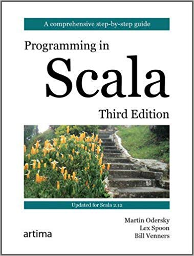

# Programming_in_Scala

Programming in Scala 3rd Edition by Martin Odersky, Lex Spoon and Bill Venners. A comprehensive book covering basic as well as advanced Scala topics such as Partial Functions, Trait Mixin, Futures and Concurency
